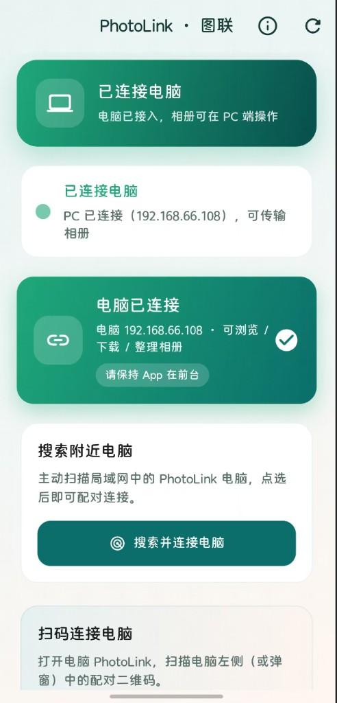
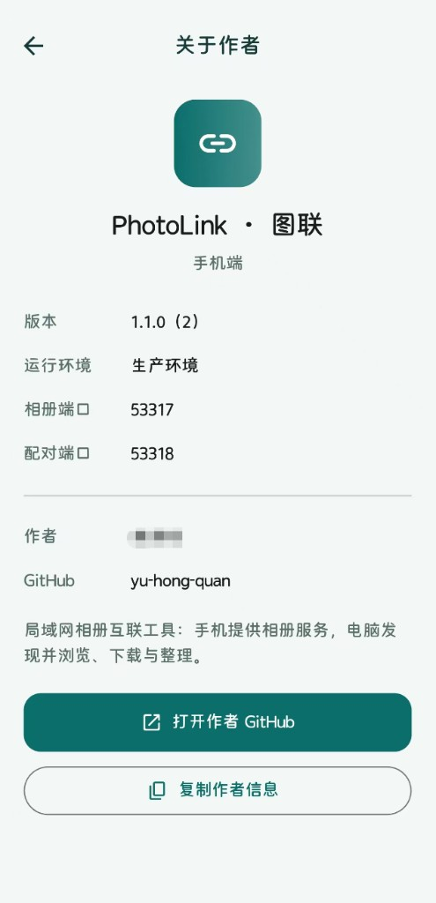

# PhotoLink · 图联（手机端）

局域网相册互联工具的 **手机端**。手机在局域网内提供相册 HTTPS 服务并广播自身；支持扫码或主动搜索电脑完成配对。电脑连接后可浏览、下载、整理手机相册。

> 配套桌面端仓库：[photolink-pc](https://github.com/yu-hong-quan/photolink-pc)

---

## 下载安装（v1.1.1 · prod）

| 端 | 文件 | 说明 |
|----|------|------|
| **手机端 APK** | [⬇️ PhotoLink-1.1.1-prod-arm64.apk](https://github.com/yu-hong-quan/photolink-app/releases/download/v1.1.1/PhotoLink-1.1.1-prod-arm64.apk) | Android 安装包（arm64，绝大多数现代手机） |
| **电脑端安装包** | [⬇️ PhotoLink-Setup-1.1.1-prod.exe](https://github.com/yu-hong-quan/photolink-pc/raw/master/releases/PhotoLink-Setup-1.1.1-prod.exe) | Windows 安装程序（在配套 PC 仓库） |

> 手机与电脑必须使用同一环境（本安装包均为 **prod**）。下载后请允许「未知来源」安装 APK；电脑端按向导安装即可。  
> APK 也可在 [Releases · v1.1.1](https://github.com/yu-hong-quan/photolink-app/releases/tag/v1.1.1) 页面获取。

---

## 界面预览

### 已连接电脑（首页）

服务运行中且电脑已接入时的状态；可搜索附近电脑或扫码配对。请保持 App 在前台以便传输。



### 关于作者

版本、运行环境、相册 / 配对端口与作者信息。



---

## 功能概览

| 能力 | 说明 |
|------|------|
| 相册服务 | 本机 HTTPS（自签名）提供相册列表 / 缩略图 / 原图 / 上传 |
| mDNS 广播 | 向局域网发布 `_photolink._tcp`，供电脑发现 |
| 搜索电脑 | 主动扫描局域网内 PhotoLink 电脑并点选配对 |
| 扫码配对 | 扫描电脑端配对二维码，把本机地址回传给电脑 |
| 回收站 | 软删除备份到本地；可撤回（写回系统相册）或彻底删除 |
| 连接状态 | PC 访问业务接口后首页展示「已连接电脑」 |
| 关于作者 | AppBar「关于」查看版本、环境、作者信息 |

---

## 环境要求

- Flutter SDK（与项目 `pubspec.yaml` 的 SDK 约束一致）
- Android 真机 / 模拟器，或 iOS 真机（需 macOS + Xcode）
- 与电脑同一 Wi‑Fi（部分路由器需关闭「AP 隔离」）
- **手机与电脑必须使用同一运行环境（FLAVOR）**

---

## 三套环境

通过编译参数 `--dart-define=FLAVOR=local|test|prod` 切换。不同环境使用不同端口，避免本机并行调试冲突。

| FLAVOR | 说明 | 相册端口 | 配对端口 |
|--------|------|----------|----------|
| `local` | 本地开发 | 53337 | 53338 |
| `test` | 测试 | 53327 | 53328 |
| `prod` | 生产（默认） | 53317 | 53318 |

---

## 快速开始

```bash
flutter pub get

# 本地环境运行（推荐调试）
flutter run --dart-define=FLAVOR=local

# Windows 脚本
.\scripts\run-android.ps1 -Env local

# macOS / iOS
./scripts/run-ios.sh local
```

---

## 打包

### Android APK

```bash
.\scripts\build-android.cmd prod
# 或
.\scripts\build-android.ps1 -Env test
```

产物：`build/app/outputs/flutter-apk/app-release.apk`

### Android AAB（上架）

```bash
.\scripts\build-android-aab.ps1 -Env prod
```

产物：`build/app/outputs/bundle/release/app-release.aab`

### iOS（需在 macOS 上）

```bash
./scripts/build-ios.sh prod
```

产物：`build/ios/iphoneos/Runner.app`  
上架 / 导出 IPA：用 Xcode 打开 `ios/Runner.xcworkspace` → Archive。

---

## 使用说明

1. 打开 App，授予相册（及相机，若扫码）权限，等待「服务运行中」。
2. **连接电脑（二选一）**
   - **搜索附近电脑**：点「搜索并连接电脑」→ 列表中点「连接」。
   - **扫码**：打开电脑 PhotoLink 二维码 → 手机「扫描电脑二维码」。
3. 配对成功后，电脑端会**自动连接并打开相册**（请保持 App 在前台）。
4. 已连接时点右上角刷新，只会软刷新广播，**不会断开**现有连接。

### 权限与网络提示

- 相册完整访问权限（否则无法提供服务）
- 扫码需要相机权限
- 防火墙 / 系统需放行：**TCP 相册端口**、**UDP 5353（mDNS）**
- 电脑防火墙需放行配对端口（见上表）

---

## 目录结构（节选）

```text
lib/
  core/           # 常量、环境 FLAVOR、设备模型
  pages/          # 首页、搜电脑、扫码、关于
  services/       # HTTPS 相册服务、mDNS、配对客户端、回收站等
  theme/          # 主题
scripts/          # 多环境运行 / 打包脚本
docs/screenshots/ # README 界面截图
assets/certs/     # 自签名证书（局域网 HTTPS）
assets/icons/     # 应用图标
```

---

## 协议要点

- mDNS 类型：`_photolink._tcp`（TXT 含 `deviceType=phone|pc`）
- 手机相册 API：`https://{phoneIp}:{galleryPort}/api/...`
- 向电脑配对：`POST https://{pcIp}:{pairPort}/api/pair`，Body 为手机设备 JSON
- 电脑配对二维码：`photolink-pc://{ip}:{pairPort}?id=...&name=...`

---

## 作者

- 作者：余洪全（yu-hong-quan）
- GitHub：https://github.com/yu-hong-quan
- 仓库：https://github.com/yu-hong-quan/photolink-app

---

## 许可

仅供学习与自用。二次分发或商用请自行评估证书、隐私与应用商店合规要求。
